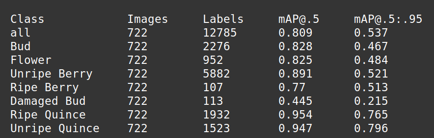
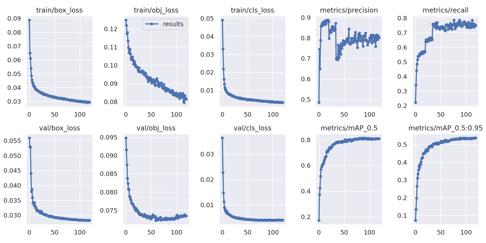

# AKFEN object detector
This repository is for the detection of the Raspberry and Quinces using the yolov5.

## YOLOv5 model parameters

The parameters after the training are as follows:



Train, validation and model parameters against the epochs is shown below:




## Dependencies
Before the training the necessary dependencies must be installed:
```
git clone https://github.com/ultralytics/yolov5.git
cd yolov5
pip install -r requirements.txt
cd ..
```

## Detection
Copy the `runs` folder present in the repository under yolov5 and use that weights for the detection:

```
cp -r runs yolov5
my_path=$(pwd)
cd yolov5
python3 detect.py --weights runs/train/exp/weights/best.pt --img 640 --conf 0.25 --source $my_path/dest
```
The results will be stored in the `yolov5/runs/detect` subdirectory.

## Acknowledgement

This work is supported by the Latvian Council of Science under the project No. lzp-2020/1-0353 “Smart non-invasive phenotyping of raspberries and Japanese quinces using machine learning and hyperspectral and 3D imaging” AKFEN.


